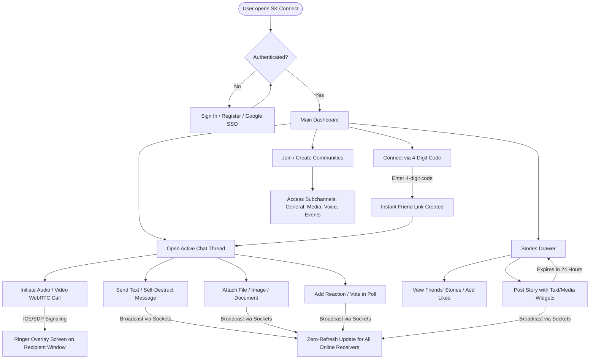

# SK Connect — Premium Real-Time Messaging & Collaboration Hub

SK Connect is a state-of-the-art, feature-rich instant messaging and communication platform designed to provide users with an immersive, secure, and beautiful social experience. Built with a modern glassmorphic interface, SK Connect features real-time text chats, WebRTC audio/video calls, expiring story sharing, Discord-style role-based communities, and an integrated AI companion.

---

## Table of Contents
- [Overview](#overview)
- [Purpose](#purpose)
- [Working Flowchart](#working-flowchart)
- [Key Features](#key-features)
  - [1. Intelligent Messaging & Quick Connect](#1-intelligent-messaging--quick-connect)
  - [2. Interactive Media & File Sharing](#2-interactive-media--file-sharing)
  - [3. Expiring Stories (WhatsApp/Instagram Style)](#3-expiring-stories-whatsappinstagram-style)
  - [4. High-Definition WebRTC Calling](#4-hd-webrtc-audio--video-calling)
  - [5. Role-Based Communities & Channels](#5-role-based-communities--channels)
  - [6. AI Copilot & Companion Sidebar](#6-ai-copilot--companion-sidebar)
  - [7. Advanced Personalizations](#7-advanced-personalizations--security)
- [User Guide & Quick Start](#user-guide--quick-start)
  - [Connecting with a New Friend](#connecting-with-a-new-friend)
  - [Starting a WebRTC Call](#starting-a-webrtc-call)
  - [Managing Communities](#managing-communities)
- [Testing & Seeder Credentials](#testing--seeder-credentials)
- [Local Running Instructions](#local-running-instructions)

---

## Overview

SK Connect bridges the gap between clean visual aesthetics and premium features. Users can interact in real-time with single and double-tick status indicators, add emoji reactions, participate in interactive polls, share files with live upload progress feedback, publish 24-hour expiring stories with rich text widgets, and organize large groups into communities with designated channel types (Text, Announcements, Q&As, Media, and Voice Rooms).

---

## Purpose

The main objective of SK Connect is to provide a single, unified communication hub that values user experience above all else. By offering zero-refresh real-time state synchronization, users can stay connected without the frustration of constant manual page reloads. Whether pairing instantly using short-lived 4-digit verification codes, enjoying voice rooms, or summarizing long group chat histories using an AI assistant, SK Connect makes digital interaction frictionless, expressive, and highly engaging.

---

## Working Flowchart

Below is the user interaction and data flow diagram of SK Connect, illustrating how users connect, message, call, and share updates across the platform:



---

## Key Features

### 1. Intelligent Messaging & Quick Connect
* **Real-Time Delivery Indicators**: Messages update instantly to reflect their delivery status with checkmarks:
  * Single Grey Tick (`✓`): Sent successfully to the cloud.
  * Double Grey Ticks (`✓✓`): Delivered to the recipient's device.
  * Double Blue Ticks (`✓✓`): Seen and read by the recipient.
* **4-Digit Quick Connect**: Skip searching complex usernames. Generate a short-lived 4-digit connection code in your profile tab to pair instantly with nearby friends.
* **Interactive Polls**: Create question cards inside chat windows with customizable options. Votes and percentages update dynamically in real time for everyone.
* **Disappearing Messages**: Set custom self-destruction timers (5 seconds, 1 minute, 1 hour, or 1 day) for messages. Expired messages fade away from both devices automatically.
* **Pinned Messages**: Pin important announcements or links in any chat. Pinned content is displayed as a premium frosted banner under the chat header; clicking the banner scrolls the screen directly to the target bubble.

### 2. Interactive Media & File Sharing
* **File Upload Chip**: Enjoy drag-and-drop or paperclip file attachment support with a file selection chip. Shows the selected file's name and size in KB along with a clear button to remove the selection before sending.
* **Sleek Media Cards**: Shared files render as stylized document containers with custom icon labels, file size metrics, and instant download buttons. Image and video attachments load using smooth responsive grid modules.

### 3. Expiring Stories (WhatsApp/Instagram Style)
* **Status Updates Bar**: View active friend stories inside a horizontal avatar row at the top of your dashboard.
* **Rich Story Creator**: Post expiring story slides with customized backgrounds, locations, mentions, hashtags, and interactive question widgets.
* **Story Engagement**: Viewers can like stories or type sliding comments, which automatically land directly in your private message inbox as a context reply.
* **Automatic 24-Hour Expiry**: Stories disappear from all feeds automatically after 24 hours.

### 4. HD WebRTC Audio & Video Calling
* ** Ringer Overlay Interface**: Initiating a call prompts an immersive, high-blur caller screen with audio ringbacks, avatar glows, and controls.
* **HD Streams**: Exchanging media streams over WebRTC with camera-flip controls, screen sharing, and audio mute/unmute buttons.
* **Missed Call System**: Call attempts are recorded and pushed into the Call History tab in real time if the recipient is busy or declines.

### 5. Role-Based Communities & Channels
* **Sub-channels Layout**: Create massive spaces organized into specific sub-channels, similar to professional collaboration tools.
* **Channel Configurations**: Sub-channels auto-generate into:
  * `#general` (Text chat)
  * `📢 announcements` (Only creators/mods can post)
  * `❓ q-and-a` (QA hub)
  * `📷 media` (Shared file feeds)
  * `📅 events` (Events schedule list)
  * `🔊 voice-room` (Audio rooms)

### 6. AI Copilot & Companion Sidebar
* **Thread Summarizer**: Catch up on long group discussions instantly. The AI companion analyzes recent messages in the open thread and generates bulleted summaries.
* **Draft Assistants**: Draft, proofread, translate, or change the tone of your chat input (e.g. make it professional, friendly, or funny) using the AI sparkles popup panel.
* **Smart Replies**: Receive contextual smart suggestion chips below the text field for instant, one-tap responses.

### 7. Advanced Personalizations & Security
* **Theme Customizations**: Toggle between Light and Dark modes. Choose from curated chat background meshes (Gradient Mesh, Deep Space, Sunset Glow, Emerald Forest).
* **Device Session Control**: View all active logins with details on browser type and location. Revoke specific device sessions remotely or log out of all other locations instantly.
* **User Blocking**: Block unwanted contacts directly from their profile card to restrict them from sending you messages or calling you.

---

## User Guide & Quick Start

### Connecting with a New Friend
1. Navigate to the **Profile** tab in the sidebar (click on your avatar).
2. Locate the **Quick Connect** section:
   * To share your code: click **Generate Code** and show the 4-digit code to your friend.
   * To connect with a friend: type their 4-digit code in the connection input field and click **Connect**.
3. A direct chat window will immediately open, and they will appear in your sidebar chats list!

### Starting a WebRTC Call
1. Open a direct chat window with a contact.
2. Click the **Phone** (Audio Call) or **Video Camera** (Video Call) icon in the top header.
3. An outgoing call overlay will appear, ringing their device. Once they click **Accept**, the video/audio streams will bind instantly.
4. Click the **End Call** button (Red Phone) at any time to hang up.

### Managing Communities
1. Click the **Explore / Communities** tab in the sidebar.
2. Click **Create Community**, upload a community banner and avatar, and input a name.
3. Once created, click on your community in the sidebar to access its channel tree. Click **Invite Link** to generate public or private JWT-signed invite links to send to your friends.

---

## Testing & Seeder Credentials

To help developers test the platform's multi-device real-time sync, WebRTC calls, and moderator capabilities, the database is preloaded with testing profiles:

* **Default Password for All Seeded Users**: `password123`
* **Seeded Sandbox Accounts**:
  * **Alice** (`alice@connect.chat` / Username: `alice`)
  * **Bob** (`bob@connect.chat` / Username: `bob`)
  * **Charlie** (`charlie@connect.chat` / Username: `charlie`)
  * **System Administrator** (`admin@connect.chat` / Username: `admin` — has moderator privileges to view the admin analytic panels)

*Tip: Open a normal browser tab and an Incognito window side-by-side to log in as Alice and Bob and test real-time features!*

---

## Local Running Instructions

Ensure you have **Node.js (v20+)** installed on your system.

### 1. Setup Backend Server
```bash
cd backend
npm install
```
* Create a `.env` file under `backend/` using the format shown in `.env.example`.
* Seed the database:
```bash
npm run seed
```
* Start the development server:
```bash
npm run dev
```

### 2. Setup Frontend Client
In a new terminal window:
```bash
cd frontend
npm install
```
* Start the development server:
```bash
npm run dev
```
* Open your browser and navigate to `http://localhost:5173`.
