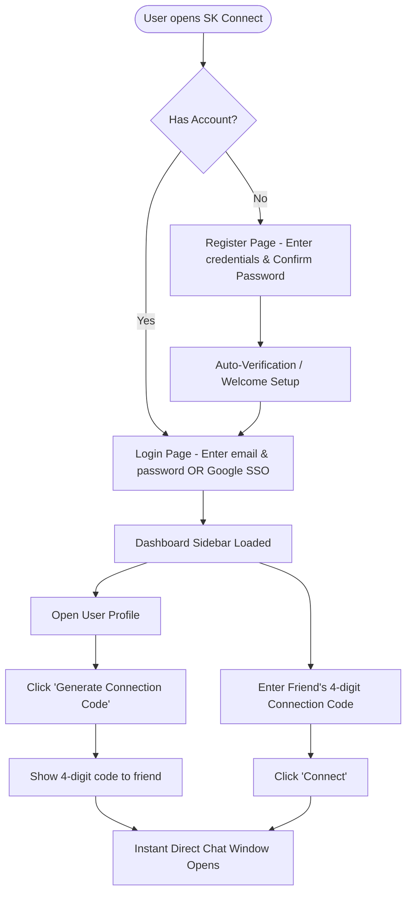
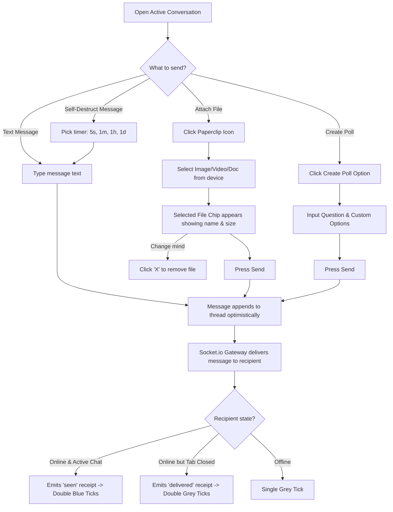
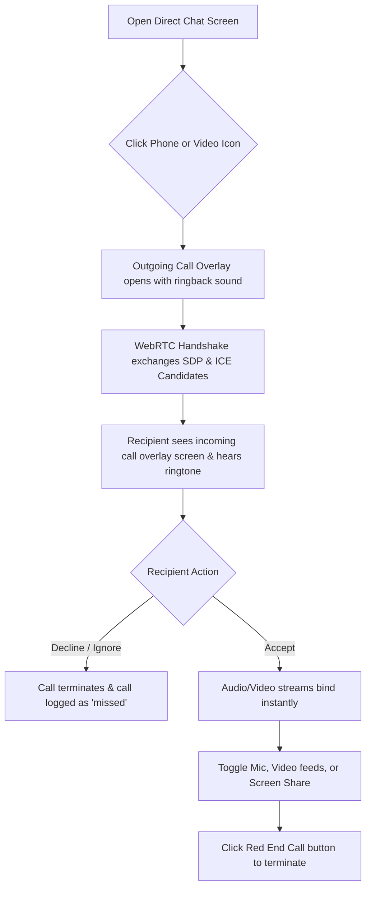
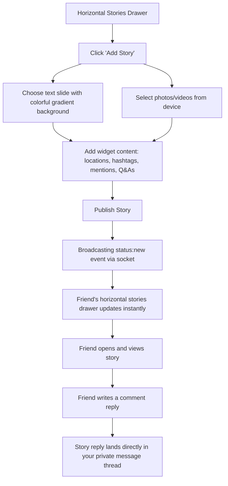
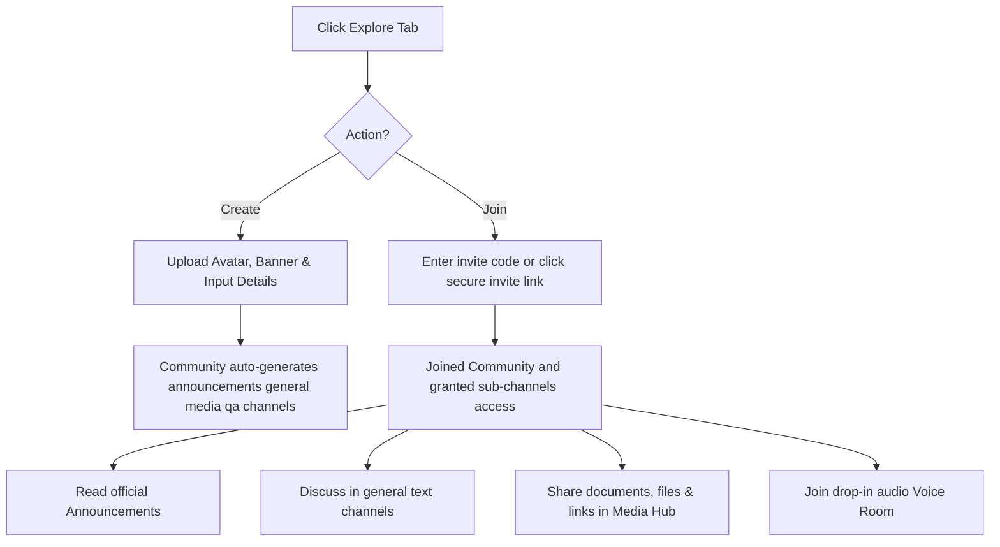

# SK Connect — Premium Real-Time Messaging & Collaboration Hub

SK Connect is a state-of-the-art, feature-rich instant messaging and communication platform designed to provide users with an immersive, secure, and beautiful social experience. Built with a modern glassmorphic interface, SK Connect features real-time text chats, WebRTC audio/video calls, expiring story sharing, Discord-style role-based communities, and an integrated AI companion.

---

## Table of Contents
- [Overview](#overview)
- [Purpose](#purpose)
- [User Experience Flowcharts](#user-experience-flowcharts)
  - [Flowchart 1: User Onboarding & Quick Connect Pairing](#flowchart-1-user-onboarding--quick-connect-pairing)
  - [Flowchart 2: Real-Time Interactive Messaging & File Sharing](#flowchart-2-real-time-interactive-messaging--file-sharing)
  - [Flowchart 3: High-Definition WebRTC Calling Loop](#flowchart-3-high-definition-webrtc-calling-loop)
  - [Flowchart 4: Expiring Stories & Engagement Flow](#flowchart-4-expiring-stories--engagement-flow)
  - [Flowchart 5: Communities & Sub-channels System](#flowchart-5-communities--sub-channels-system)
- [Detailed Section Working (User Prospectus)](#detailed-section-working-user-prospectus)
  - [1. Getting Started & Connecting with Friends](#1-getting-started--connecting-with-friends)
  - [2. Conversing, Sharing Files, & Interactive Polls](#2-conversing-sharing-files--interactive-polls)
  - [3. Expiring Stories & Media Widgets](#3-expiring-stories--media-widgets)
  - [4. Seamless Voice & Video Calling](#4-seamless-voice--video-calling)
  - [5. Role-Based Communities & Channels](#5-role-based-communities--channels)
  - [6. AI Copilot & Personal Settings](#6-ai-copilot--personal-settings)
- [Testing & Seeder Credentials](#testing--seeder-credentials)

---

## Overview

SK Connect bridges the gap between clean visual aesthetics and premium features. Users can interact in real-time with single and double-tick status indicators, add emoji reactions, participate in interactive polls, share files with live upload progress feedback, publish 24-hour expiring stories with rich text widgets, and organize large groups into communities with designated channel types (Text, Announcements, Q&As, Media, and Voice Rooms).

---

## Purpose

The main objective of SK Connect is to provide a single, unified communication hub that values user experience above all else. By offering zero-refresh real-time state synchronization, users can stay connected without the frustration of constant manual page reloads. Whether pairing instantly using short-lived 4-digit verification codes, enjoying voice rooms, or summarizing long group chat histories using an AI assistant, SK Connect makes digital interaction frictionless, expressive, and highly engaging.

---

## User Experience Flowcharts

### Flowchart 1: User Onboarding & Quick Connect Pairing
This flowchart describes the path from landing on SK Connect, registering or authenticating via Google SSO, to pairing instantly with another user using a 4-digit code.

### Flowchart 2: Real-Time Interactive Messaging & File Sharing
This flowchart illustrates the messaging interface activities, including file selection previews, interactive polls, message reactions, and disappearing timers.

### Flowchart 3: High-Definition WebRTC Calling Loop
This flowchart describes how a user starts a voice or video call, exchanges live streams, and interacts with media controls.

### Flowchart 4: Expiring Stories & Engagement Flow
This flowchart describes the creation of 24-hour status slides, widgets configurations, and friend engagements.

### Flowchart 5: Communities & Sub-channels System
This flowchart illustrates the Discord-style community structure, from joining via secure links to interacting in categorized channels.

---

## Detailed Section Working (User Prospectus)

### 1. Getting Started & Connecting with Friends
* **Google SSO & Credentials Log In**: When you first visit SK Connect, you can log in securely using your Google Account with a single tap, or register using a standard email. If you register, the password confirmation field helps prevent spelling mistakes.
* **4-Digit Quick Connect Pairing**: Instead of asking friends for complex, case-sensitive usernames, you can connect instantly. One user click **Generate Connection Code** to receive a 4-digit code. The other user inputs this code into their **Quick Connect** box and hits **Connect**. A private direct chat thread opens instantly on both dashboards.

### 2. Conversing, Sharing Files, & Interactive Polls
* **Premium Real-Time Chatting**: All message actions—including sending, editing, and deleting messages—update instantly for both participants. Centered reaction panels let you tap on an emoji to react to messages in real time.
* **Visual File Attachments**: Clicking the paperclip icon opens your device file selector. When a file is chosen, a preview chip appears showing the filename and size, letting you double-check your selection before sending or click the close icon to remove it. Once sent, it appears as a clean card showing the filename and download button.
* **Self-Destruct Messages**: If you are sharing sensitive information, select a self-destruct duration next to the text input. Once the countdown expires, the message bubble automatically dissolves from both screens.
* **Interactive Polls**: Write a question and add options to gather group opinions. Friends click directly on options to vote, and percentage bars animate in real time.

### 3. Expiring Stories & Media Widgets
* **Status Updates drawer**: View expiring stories posted by your contacts in a horizontal bar at the top of the chat panel. A colorful ring around a contact's avatar indicates a new, unviewed story.
* **Interactive Widgets**: Create status slides featuring custom gradient backgrounds or local photos. Add mentions, locations, hashtags, or interactive Q&A sliders to gather feedback.
* **Direct Inbox Replies**: While viewing stories, you can type a comment reply. This sends your reply directly into your private chat thread with that contact, along with a context snippet of the story.

### 4. Seamless Voice & Video Calling
* ** Ringer Overlay System**: Tapping the call icons rings the recipient's device. Both devices show a blurred backdrop overlay showing the caller's avatar and a ringing notification, accompanied by a premium ringtone.
* **HD In-Call Toggles**: During calls, you can toggle your microphone or camera feed on and off, switch to screen sharing, or hang up. If a call is declined or missed, it is immediately logged in the **Calls** history tab.

### 5. Role-Based Communities & Channels
* **Discord-Style Channels**: Communities organize large group interactions into structured channel lists, preventing cluttered feeds.
* **Category Channels**: Channels are pre-categorized for clean communication:
  * **Announcements**: Broadcasters share important notifications; standard members are muted.
  * **General**: Standard open discussion panel.
  * **Q&A**: A specialized thread where users can ask questions and resolve answers.
  * **Media Hub**: Dedicated grid displaying all links, files, and photos shared inside the community.
  * **Voice Room**: Drop-in audio channel. Click it to immediately join a voice room and talk with other active members.

### 6. AI Copilot & Personal Settings
* **AI Copilot Sidebar**: Click the Sparkles icon to open the AI sidebar helper. It reviews the recent message history of the chat and provides quick bulleted summaries or facts checking.
* **Drafting Helpers**: Smart suggested replies appear as chips below your chat input for quick one-tap sending. You can also click the sparkles next to the input text field to translate your message or change its tone.
* **Session Manager & Blocking**: In the **Settings** panel, view details of all active logins. Revoke specific device logins remotely if you suspect unauthorized access. You can also toggle blocking for specific contacts to restrict them from messaging or calling you.

---

## Testing & Seeder Credentials

To help test the platform's multi-device real-time sync, WebRTC calls, and moderator capabilities, the database is preloaded with testing profiles:

* **Default Password for All Seeded Users**: `password123`
* **Seeded Sandbox Accounts**:
  * **Alice** (`alice@connect.chat` / Username: `alice`)
  * **Bob** (`bob@connect.chat` / Username: `bob`)
  * **Charlie** (`charlie@connect.chat` / Username: `charlie`)
  * **System Administrator** (`admin@connect.chat` / Username: `admin` — has moderator privileges to view the admin analytic panels)

*Tip: Open a normal browser tab and an Incognito window side-by-side to log in as Alice and Bob and test real-time features!*
