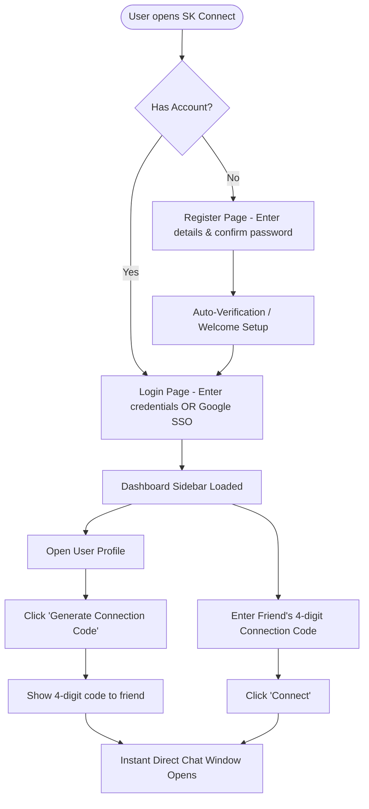
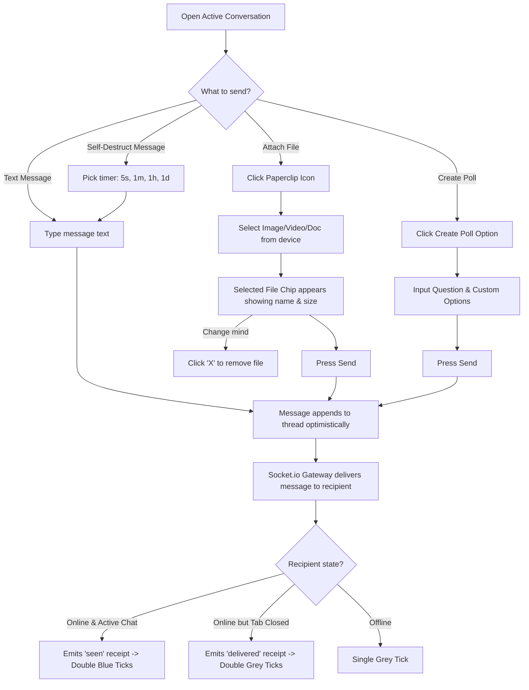
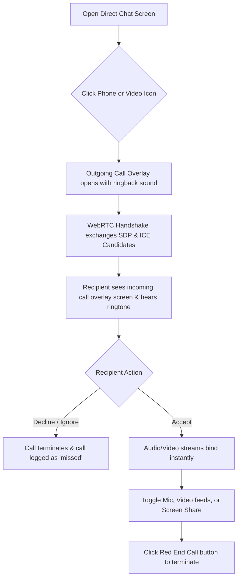
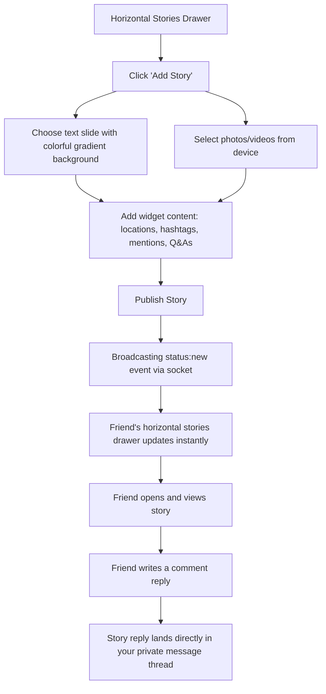
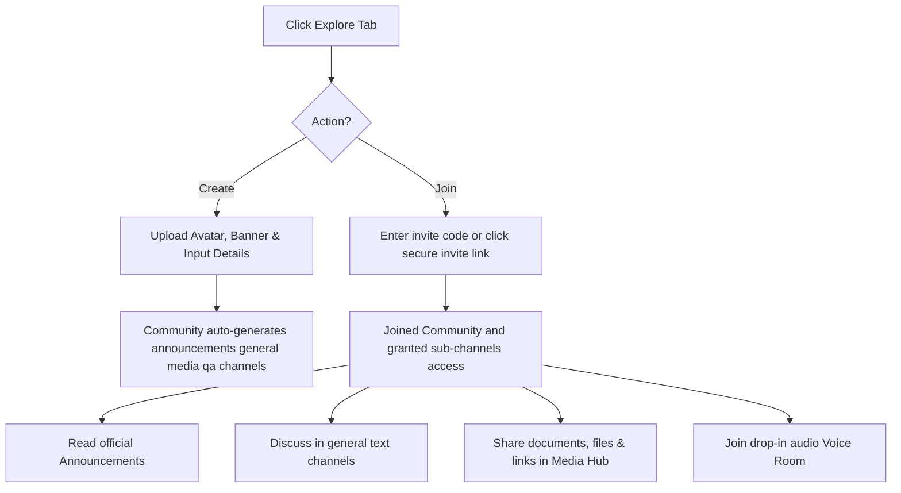
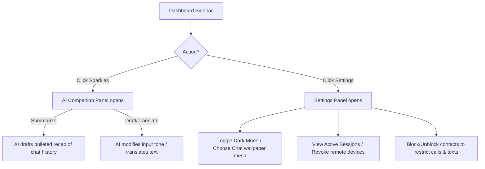

# SK Connect — Premium Real-Time Messaging & Collaboration Hub

SK Connect is a state-of-the-art, feature-rich instant messaging and communication platform designed to provide users with an immersive, secure, and beautiful social experience. Built with a modern glassmorphic interface, SK Connect features real-time text chats, WebRTC audio/video calls, expiring story sharing, Discord-style role-based communities, and an integrated AI companion.

---

## Table of Contents
1. [User Onboarding & Identity Pairing](#1-user-onboarding--identity-pairing)
2. [Interactive Real-Time Messaging](#2-interactive-real-time-messaging)
3. [High-Definition WebRTC Calling](#3-high-definition-webrtc-calling)
4. [Expiring Status Stories](#4-expiring-status-stories)
5. [Discord-Style Communities & Channels](#5-discord-style-communities--channels)
6. [AI Companion & Settings Control](#6-ai-companion--settings-control)
7. [Testing & Seeder Credentials](#testing--seeder-credentials)

---

## 1. User Onboarding & Identity Pairing

### Purpose
To provide users with a secure, instant onboarding experience via modern social sign-ins, and allow them to establish private connections with friends without searching through cluttered databases.

### Working
* When you open the application, you can sign in instantly using the **Continue with Google** one-tap button, or register using a standard email address. A password verification check ensures there are no spelling mistakes during registration.
* Once logged in, open the **Profile** tab from the sidebar. You can generate a short-lived **4-Digit Connection Code** to display to your friend. 
* To connect with a friend, simply type their 4-digit code in your connection panel and click **Connect**. A private direct chat thread opens instantly for both of you.

### Flowchart

### Key Features
* Secure Google OAuth 2.0 Single Sign-In integration.
* Secure email registration with password verification checks.
* Short-lived, secure 4-digit connection codes for quick pairing.
* Automatic real-time sidebar chat listing upon connection pairing.

---

## 2. Interactive Real-Time Messaging

### Purpose
To enable expressive, secure, and real-time private conversations with friends through instant messaging, file previews, voting polls, and disappearing texts.

### Working
* Open any chat room from the sidebar. When you type and send messages, they are pushed instantly. Tapping on a message bubble opens a center reaction panel where you can choose an emoji reaction.
* To share files, tap the **Paperclip** button. An attachment preview chip will appear above the text box, showing the selected file's name and size in KB. Click the close button if you'd like to clear it before pressing send.
* To create a poll, click the poll icon, type your question, and input options. The poll renders as a clean card where users vote by tapping options, updating percentages in real-time.
* Toggle a self-destruct timer (e.g. 5 seconds, 1 minute) next to the input text field. Sent messages will automatically disappear from both screens once the timer expires.

### Flowchart

### Key Features
* Real-time read receipt ticks (`✓` Sent, `✓✓` Delivered, `✓✓` Seen blue ticks).
* Visual file upload chips with live preview information and clear button.
* Interactive polls with live percentage counting and multiple choice option ticks.
* Disappearing self-destruct message timers to secure private shared data.
* Frosted pin banners displaying pinned announcements with scroll-to-view navigation.

---

## 3. High-Definition WebRTC Calling

### Purpose
To provide high-definition, peer-to-peer audio and video calls directly inside the web browser with seamless stream toggles and connection state indicators.

### Working
* Open a direct chat window with a contact and click the **Phone** (Audio Call) or **Video Camera** (Video Call) button in the header.
* An outgoing calling overlay screen will slide in, ringing their device. The recipient's window will display an incoming calling overlay with an active ringtone.
* Exchanging SDP and ICE candidates establishes the WebRTC peer-to-peer connection. Tapping call action buttons lets you mute your microphone, turn off your camera, or switch to screen-sharing mode.
* Click the red **End Call** button at any time to hang up. Any missed or rejected call attempts are logged in the Call History list.

### Flowchart

### Key Features
* One-click Peer-to-Peer HD voice and video calling.
* Immersive calling ring screens with high-blur aesthetics and ringtones.
* Mid-call toggles for microphone, camera, and display screen-sharing.
* Missed and rejected call logging in call history lists.

---

## 4. Expiring Status Stories

### Purpose
To let users post temporary, media-rich status slides that disappear automatically after 24 hours, encouraging casual and creative interactions.

### Working
* View unread status updates from your contacts inside the horizontal stories drawer at the top of your dashboard.
* Click **Add Story** to open the story creator. You can select gradient background slides, or upload photos/videos. You can overlay rich widgets such as location tags, hashtags, mentions, or interactive Q&A sliders.
* Publish your story to automatically push a socket update to your contacts. Your story ring will light up in their horizontal stories drawer.
* When friends view your story, they can type a comment reply. This reply will instantly land inside your direct private chat thread as a reply snippet.

### Flowchart

### Key Features
* Premium horizontal stories bar with unread status ring indicators.
* Rich widget overlay creator (mentions, hashtags, locations, and Q&A).
* Story views and likes counter syncing.
* Direct story-slide messaging replies forwarded to the private inbox.
* Automatic 24-hour expiration from database and dashboard views.

---

## 5. Discord-Style Communities & Channels

### Purpose
To host large groups and structured organizations, separating discussions into dedicated, categorized channels to avoid chaotic group messaging.

### Working
* Go to the **Explore / Communities** tab in your sidebar. To create a community, click **Create Community**, upload a banner and avatar, and input a name.
* Communities are generated with pre-configured channel hubs:
  * **Announcements**: Where admins share broad updates; standard members cannot message.
  * **General**: Standard open discussion text channel.
  * **Q&A**: A specialized thread where users can ask questions and resolve answers.
  * **Media**: Grid displaying all documents, links, and photos shared.
  * **Voice Room**: Drop-in voice chat room. Click to join and converse with online members.
* Share secure public invite codes or private signed invite links with friends to let them join your community instantly.

### Flowchart

### Key Features
* Auto-generated community layout (Announcements, General, QA, Media, Voice).
* Invite generator creating public codes or private JWT-signed links.
* Dedicated drop-in Voice Rooms for real-time audio chat.
* Integrated Media Hub organizing all shared files and links.

---

## 6. AI Companion & Settings Control

### Purpose
To enhance conversation productivity with an AI assistant, customize visual theme layouts, and secure access parameters.

### Working
* Click the **Sparkles** icon inside any chat to open the AI Sidebar. You can ask the assistant to generate bulleted summaries of the thread context. Below the input text box, click the AI Suggestion chips for quick, smart one-tap replies.
* Tap the sparkles next to your typing cursor to translate your message or alter its tone (e.g. adjust to formal, humorous, or concise).
* Open the **Settings** panel to select custom background meshes (Gradient Mesh, Sunset Glow, Emerald Forest, etc.) or toggle dark/light theme formats.
* In the **Active Sessions** section, review active browser logins. You can revoke specific device sessions remotely or log out of all other locations instantly to secure your account.

### Flowchart

### Key Features
* AI Companion sidebar analyzing active conversation contexts.
* Tone modifiers and language translation overlays for text inputs.
* Contextual smart reply recommendation chips.
* Dynamic theme toggle (Dark/Light mode) and chat wallpapers mesh.
* Device session monitoring and remote logout revocation.

---

## Testing & Seeder Credentials

To help test the platform's multi-device real-time sync, WebRTC calls, and moderator capabilities, the database is preloaded with testing profiles:

* **Default Password for All Seeded Users**: `password123`
* **Seeded Sandbox Accounts**:
  * **Alice** (`alice@connect.chat` / Username: `alice`)
  * **Bob** (`bob@connect.chat` / Username: `bob`)
  * **Charlie** (`charlie@connect.chat` / Username: `charlie`)
  * **System Administrator** (`admin@connect.chat` / Username: `admin` — has moderator privileges to view the admin analytic panels)

*Tip: Open a normal browser tab and an Incognito window side-by-side to log in as Alice and Bob and test real-time features!*
