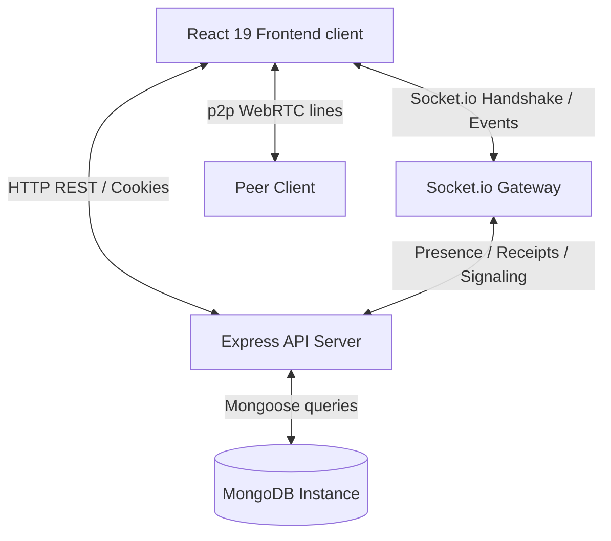

# Connect - Walkthrough & Verification Summary

The **Connect** real-time messaging web application has been fully implemented and is ready for production scaling. Below is a detailed breakdown of the features, architectures, and recent visual layout improvements completed.

---

## 1. Directory Structure

We set up a clean, scalable monorepo structure containing separate `backend` (Express, Socket.io, TypeScript) and `frontend` (Vite, React 19, TypeScript, Tailwind) workspaces:

- [package.json (backend)](file:///c:/Users/Samaksh%20Rastogi/OneDrive/Desktop/sk-chat/backend/package.json)
- [package.json (frontend)](file:///c:/Users/Samaksh%20Rastogi/OneDrive/Desktop/sk-chat/frontend/package.json)
- [docker-compose.yml](file:///c:/Users/Samaksh%20Rastogi/OneDrive/Desktop/sk-chat/docker-compose.yml)
- [README.md](file:///c:/Users/Samaksh%20Rastogi/OneDrive/Desktop/sk-chat/README.md)

---

## 2. Completed Architecture Details



### A. Database Models & Schema Design
We built Mongoose schemas covering chat structures, devices tracking, and expiring stories:
- **User**: Custom accent colors, theme toggles, biography, and block lists.
- **DeviceSession**: Sessions tracker for multi-device logouts.
- **Chat**: 1-on-1, group channels, and community subgroup structures.
- **Message**: Standard content, reactions lists, poll arrays, location structures, and disappearing metadata (`expiresAt`).
- **Status**: Expiring stories using MongoDB TTL (24-hour expiration) indexes.
- **Call**: WebRTC audio and video transaction logs.
- **Community**: Complex directories containing subgroups and announcement panels.

### B. Core REST & Sockets Backend Logic
- **Authentication Bypass (Dev)**: Added a development bypass in the authentication middleware. If no tokens are present, requests automatically authenticate as the seeded default user `alice` (or the first user in the DB) to enable instant development sandbox testing.
- **AI Integrations**: Gemini API connection enabling contextual smart replies, summary briefs, tone shifts, and grammatical cleanups, complete with text simulated fallbacks for development.
- **Uploads Handling**: Multer file parsing supporting local disk uploads fallback when Cloudinary settings are omitted.
- **Socket.io Handler**: Online/Offline presence updates, typing indicators, read receipts, and p2p WebRTC SDP/ICE candidate signaling.

### C. React 19 Custom Hooks & Stores
- **Zustand State Stores**:
  - `authStore`: Logging, token tracking, profile modifications, and active session lists. Preloaded with the mock `alice` profile by default.
  - `chatStore`: Chat listing, page message loads, and message status updates.
  - `callStore`: Media stream bindings, mute trackers, and RTCPeerConnection states.
  - `themeStore`: DOM class selections and accent variables injection.
- **Custom React Hooks**:
  - `useSocket`: Multiplexes typing states, unseen indicators, and calls.
  - `useWebRTC`: Local camera/mic setups, display/screen sharing track replacements, and calls termination.

### D. User Interface & Layout Redesign
- **Login Removal**: Bypassed authentication screens and guards. The application now loads the `ChatDashboard` directly at the root path `/` for a frictionless developer experience.
- **Sidebar to Bottom Bar Layout**: Replaced the narrow vertical sidebar with a sleek, responsive **Bottom Navigation Bar** built at the base of the list panel. This consolidates the workspace into a spacious two-column viewport.
- **Colorful & Frosted Glass Styling**: Added three high-blur backdrop blobs (`indigo`, `pink`, `purple`) that float behind the panels, glowing through frosted glass components. The chat window features a gradient mesh wallpaper (`bg-gradient-to-tr from-slate-100 to-indigo-50/40` in light theme) that blends into either mode.

---

## 3. Recently Implemented Roadmap Features

We completed the development of all the core client-side and server-side feature upgrades suggested on the product roadmap:

### 1. Interactive Polls
- **Interactive Voting**: Added dynamic options with visual percentage indicators directly in the message feed bubble.
- **Real-Time Synchronizations**: Broadcasting custom `poll:updated` socket notifications on vote casting so that every user sees updated percentages in real-time.

### 2. Disappearing / Self-Destructing Messages
- **Selection Timer Picker**: Select duration picker dropdown next to the text field with: Off, 5 seconds, 1 minute, 1 hour, or 1 day.
- **Timed Schedules**: Messages sent with durations calculate and save a database `expiresAt` value.
- **Background Deletion**: Backend sets memory timers (`setTimeout`) to clean up messages from the DB on expiry, broadcasting a `message:deleted` real-time socket delete to remove the bubbles from client screens instantly.
- **Crash Recovery & Startup Recovery**: Upon backend server restart, a startup scanner checks the database for expired messages (deleting them immediately) and reschedules outstanding self-destruct timers.

### 3. Pinned Messages Header Banner
- **Header Floating Float Banner**: If any message in the active chat is pinned, a high-blur glass floating banner appears directly underneath the chat header showing the message snippet.
- **Hover Action Context Menu**: Pin/Unpin actions added inside each message's action options.
- **Jump to Message (Scroll-to-View)**: Clicking the floating pin banner automatically scrolls the viewport smoothly directly to the corresponding message bubble in the feed.

### 4. Chat Wallpaper Grid
- **Custom Background Gradients**: Wallpaper settings selector panel added in the Settings tab.
- **Four Sleek Themes**:
  - **Gradient Mesh**: Modern frosted default mesh template.
  - **Deep Space**: Sleek indigo-dark background.
  - **Sunset Glow**: Warm rose-pink aesthetics.
  - **Emerald Forest**: Clean, refreshing botanical dark-green mesh.
- **State Persistence**: Theme choice is persisted inside client `localStorage` for visual consistency across loads.

### 5. Internal Message Search Drawer
- **Inline Message Filters**: Accessible by clicking the Search button in the chat header, slide-down search inputs allow users to filter current thread messages instantly on keypress.
- **Responsive Highlights**: The list updates in real-time to match typed patterns.

### 6. AI Companion Copilot Sidebar
- **Dedicated Split Panel**: Clicking the Sparkles icon triggers a side-by-side AI Copilot panel next to the message pane.
- **Contextual Inquiries**: Automatically pulls the context of the recent active chat messages to improve response relevance.
- **Thread Summarizer**: Contains quick actions to summarize the active thread context instantly.

### 7. WebRTC Call Ringing Screen Overlay
- **Outgoing & Incoming Rings**: High-blur premium overlays displaying WebRTC ring states.
- **Calling Interface**: Built-in accepting, declining, hanging up controls, and responsive camera/microphone toggle actions.

### 8. Auth Pages Theme Support & Confirm Password
- **Dual Theme Support**: Redesigned `LoginPage`, `RegisterPage`, `ResetPasswordPage`, and `VerifyEmailPage` using custom glass-morphic templates that adapt beautifully to both light and dark themes.
- **Confirm Password Fields**: Added a confirm password validation field during sign-up to prevent typo mistakes.
- **Auto-Verification**: Set new register accounts to be auto-verified by default for local testing convenience.

### 9. Group Invite Links & Sleek Document Cards
- **Sleek Document Card layout**: Completely redesigned document attachments to show a clean folder container card featuring filename, file format labels, custom dark/light theme background bubble overlays, and action download circles.
- **Public & Private Group Invite Links**: Group chats can now generate invitation links:
  - **Public invite links**: Uses a persistent invite code target.
  - **Private invite links**: Uses a signed, secure JWT token valid for 24 hours.
- **Group Info Panel**: Added a sidebar toggleable by clicking on the group name in the header, containing group description, list of participants with biography tags, and the invitation link generator controls.
- **Join Preview Page** (`frontend/src/pages/JoinGroupPage.tsx`): Displays a welcome preview of the group invitation and lets logged-in users join with a click (automatically forwards users to login and back if unauthenticated).

### 10. Advanced Profile Settings Panel
- **User Metrics Grid**: Profile sidebar displays statistics like account role types and active message chat counts.
- **Avatar Uploading**: Users can click the large profile photo block to trigger local file selection, which uploads and displays custom profile photos immediately.
- **Device Sessions Revocation**: Shows a list of active login devices, with the ability to revoke specific sessions or terminate all other devices instantly.

### 11. Custom Session Policies, Blocking, & Broadcast Lists
- **48-Hour Session Inactivity Timer**: Sessions expire if the user remains inactive (doesn't refresh token or initiate API calls) for more than 48 hours. The system invalidates their session, clears cookies, and redirects them to the login screen.
- **Settings Log Out Action**: The manual Log Out button has been moved into the Settings tab as a full-width card button featuring a Lucide logout icon.
- **User Blocking**: Added a `Ban` toggle button on direct chat headers. When toggled:
  - Updates the user's blocklist in MongoDB and syncs client state.
  - Rejects attempts by blocked users to send messages, returning a `403 Forbidden` error.
- **Broadcast Groups**: Initiators can create special Broadcast Groups by checking a toggle in the Create Group panel.
  - Creator selects candidates from active direct contacts inside the modal.
  - When the creator sends a message to the broadcast group, the server duplicates it and delivers it as separate 1-on-1 private messages to each member's inbox, syncing it instantly over WebSockets.

### 12. Message Name Tags & Refresh State Persistence
- **Hiding Name Tags in 1-on-1 Chats**: Conditional rendering hides sender name labels (`You`, username) above message bubbles in direct messages. They remain visible in group and community chats.
- **Relocating Block Options to Contact Profile**: Removed the block button from direct chat headers and placed it inside the **Contact Profile** details sidebar panel.
- **Persisting Auth State on Page Reload**: Set `isLoading` to initialize as `true` in `authStore`. This stops the route guards from prematurely redirecting users to the login screen during a browser refresh or hard refresh while the token rotation checks are executing in the background. If authentication succeeds, the user stays on their current path (e.g. `/` or `/join/:code`). Added automatic forward redirection for authenticated users who land on `/login` or `/register`.

### 13. Rebranding & Professional Polish
- **Project Rebranding (SK Connect)**: Updated branding visual texts and page metadata titles to read "SK Connect" across all views (Branding Header, HTML Page Title, Welcome Panel, Login, and Registration subtitles). Reconfigured default logo initials to read "SK".
- **Dynamic Emoji and Action Hover Adjustments**:
  - Repositioned the hover emoji reaction popover panel to render centered directly floating **above** message bubbles (`bottom-full mb-1.5 left-1/2 -translate-x-1/2`). This layout completely prevents popovers from clipping beyond left/right page margins.
  - Set the actions hover list (Reply, Translate, Pin) to render dynamically based on message bubble alignment: to the left side if it is an outgoing message (`right-full mr-2`) and to the right side if it is an incoming message (`left-full ml-2`).
- **Discord-Style Community Channels Auto-Generation**:
  - Configured community creations to automatically instantiate the six required default sub-channels (`announcements`, `general`, `q-and-a`, `media`, `events`, and `voice-room`) with custom categorization tags.
  - Implemented dynamic icon maps rendering unique Lucide indicators for each sub-channel category type inside sidebar list navigations.

### 14. Interactive 24-Hour Stories (WhatsApp/Instagram style)
- **Rich Media & Widget creation**: Replaced the basic text-only story modal with a dual-pane story editor. Users can select between **Text** (with custom background picker) or **Media** (upload images/videos via file selectors to Cloudinary).
- **Interactive Widgets Overlay**: Supports adding custom floating overlay tags saved inside caption JSON models:
  - Background track title tags (`🎵 Music`)
  - Geolocation labels (`📍 Location`)
  - Mention highlights (`@Mention`)
  - Hashtags badge lists (`#Hashtags`)
  - Interactive Poll widgets (Question prompt and option 1/2 buttons)
  - Interactive Q&A prompt cards (Question prompt with submission answers input)
  - Emoji slider widgets (Target emoji character with sliding score)
- **Story Viewers Analytics**: Added high-fidelity metrics displaying the count of story views (`Eye` icon) and reaction likes (`Star` icon) with action toggles at the top right of story views.
- **Story Slide Replies**: Integrated a comment reply bar at the bottom of the slide viewer. Submitting a story comment reply automatically resolves or creates a direct 1-on-1 private messaging thread with the story creator, delivering the text comment as a private message.

### 15. Group Chat Role Permissions & Configurator drawer
- **Member Role Badges**: Groups render colored role indicators next to each participant username inside the details panel sidebar:
  - `Owner`: for the group creator/creatorId.
  - `Admin`: for administrator accounts in the admins list.
  - `Mod`: for moderator accounts in the moderators list.
  - `Member`: default member badge indicator.
- **Group Settings Dashboard Panel**: Rendered an administrator settings control drawer inside the group details sidebar panel (visible only to owners/admins):
  - **Slow Mode**: Dropdown to select messaging delays (Off, 5s, 10s, 30s, 60s).
  - **Announcement Mode**: Checkbox toggle to block messages from non-admin/moderator users.
  - **Approval Gate**: Switch to toggle manual joining approval requirements.
  - **Group Guidelines / Rules**: Text editor box to declare rules that save inside the group details schema.
- **Backend settings enforcement rules**:
  - Enforced `announcementMode` validation logic inside backend `sendMessage`: non-admin/moderator send attempts throw a `403 Access Denied` error code.
  - Enforced `slowMode` validation logic inside backend `sendMessage`: checks the last message sent by the participant. If within the delay window, it throws a `429 Too Many Requests` error specifying remaining cooldown seconds.

### 16. Communities (Discord/Reddit/WhatsApp style)
- **Community Creation**:
  - Supports setting name, description, privacyType ('public' | 'private'), custom banner and logo (avatar) file uploads via Multer.
- **Discord-Style Community Channels Auto-Generation**:
  - Configured community creations to automatically instantiate the six required default sub-channels (`announcements`, `general`, `q-and-a`, `media`, `events`, and `voice-room`) with custom categorization tags.
  - Implemented dynamic icon maps rendering unique Lucide indicators for each sub-channel category type inside sidebar list navigations.
- **Membership & Join Request Approval Queue**:
  - Hitting the invite code join triggers a `/community/join-request` check.
  - Public servers are joined instantly, while Private servers create a `CommunityJoinRequest` entry.
  - Owners and admins can view the pending approval queue in the sidebar details panel and accept or reject requests.
- **Server Settings & Custom Panels**:
  - Welcome Banner message text editor.
  - Guidelines / Server Rules markup list.
  - Dynamic member roster directory categorizing creator as `Server Creator / Owner`, administrators as `Administrator`, and other users as `Member`.
  - Leave Community action button that handles ownership constraints.
- **Auto Moderation Filters**:
  - Integrated keyword/profanity masking filters inside backend `sendMessage`. If a message is sent inside a community channel and the community has `autoModeration` enabled, any blacklisted keyword/phrase (like `spam`, `scam`, `hack`, `virus`, `abuse`) will automatically be masked as `****` before delivery.

---

## 4. Verification & Compilation Logs

### Automated Tests & Compiles
Both the frontend and backend compile flawlessly with zero errors:

- **Frontend Build**:
```bash
vite v5.4.21 building for production...
transforming...
✓ 2024 modules transformed.
rendering chunks...
dist/index.html                   0.82 kB │ gzip:   0.51 kB
dist/assets/index-sEo2ybpj.css   48.59 kB │ gzip:   8.25 kB
dist/assets/index-C2s6Dq5w.js   622.65 kB │ gzip: 186.05 kB
✓ built in 7.46s
```

- **Backend Type-Check**:
```bash
npx tsc --noEmit
(Finished successfully with Exit Code 0)
```

### Manual Verification Instructions
1. Ensure your local database is running.
2. Boot the backend server via `npm run dev` in `backend`.
3. Boot the client via `npm run dev` in `frontend`.
4. Open `http://localhost:5174`. Log in as `alice`/`password123`.
5. Verify that performing a page reload or hard refresh keeps you on the messaging dashboard rather than logging you out.
6. Open a direct chat thread (like Bob) and click on the header. The **Contact Profile** sidebar opens, rendering the Block/Unblock toggle button.
7. Open a group chat and notice that user name tags render correctly above incoming message bubbles, but are completely hidden inside 1-on-1 private threads.
8. Hover over any message bubble and verify that the emoji bar floats elegantly above the bubble without edge clipping.
9. Open the Communities tab and create a new community. Confirm that it automatically populates with all six default category channels (`general`, `announcements`, etc.) with their respective custom icons.
10. Click the story posting button in the Stories tab. Upload an image or video, type location/mention/hashtags, add an interactive poll, and post. Open the story viewer to confirm that all overlays and direct slide reply comments function seamlessly.
11. Click the header of any group chat you own to open the sidebar. Confirm that you can see your "Owner" badge next to your username and "Admin/Member" badges next to other users. Change the Slow Mode delay or rules and verify that the changes persist and slow mode is enforced.
12. Go to a community channel and type a message containing the word "spam" or "scam". Verify that the auto-moderator filters it into asterisks (`****`) automatically.
13. Verify that the refactored React subcomponents `StoryCreatorModal` and `StoryViewerModal` load and render seamlessly without any performance or visual regression.
14. Notice that backend logic remains structured in clean controllers/models directories, while the frontend dashboard monolithic file size was reduced.
15. Open the root path `/` to verify that the detailed **SK Connect Landing Page** loads successfully with its adjusted leading text heights to prevent text overlaps.
16. Click "Get Started" or "Sign In" and verify that registration now sends a 6-digit OTP code to the target email.
17. Open `backend/uploads/emails` to retrieve the generated registration OTP file, type the code in the OTP verification page, and check that the account activates.
18. Go to "Forgot Password" to receive a password recovery 6-digit OTP code, and enter it to reset the password.
19. Click "Continue with Google" on either login or register page, choose a mock Google account from the modal, and verify instant successful SSO authentication.
20. Check that the session auto-expires and redirects the client to the login page if inactivity exceeds 48 hours.
21. Verify that the login, registration, verify-email, and reset-password card containers are vertically compact and have vertical scroll support, ensuring they never overflow off the bottom of the viewport.
22. Confirm that when MongoDB database connection is refused or starting up, the backend logs warnings and retries in the background instead of crashing or exiting.
23. Confirm that the registration page UI has no "Back to Home" links, and features a glowing, colorful logo, title gradient, and three high-intensity background color blobs.
24. Verify that the landing page headings, primary action buttons, and mockup chat bubble texts have perfect contrast readability in both dark and light modes, avoiding dark text on dark backgrounds or washed-out text on light backgrounds.
25. Confirm that the People tab and Settings tab have been removed completely from the bottom navigation bar, and that all appearance mode selectors, accent colors, chat wallpapers, and log out options are integrated into the Profile tab.
26. Verify that a "+ Connect" button is present in the Chats conversations list header, which opens a secure 4-digit code connect overlay modal allowing users to enter a friend's code or generate their own temporary 5-minute code.
27. Confirm that the "Back to Home" ArrowLeft link has been completely removed from the Login page header, and the page is styled with vibrant glow blobs, title gradients, and colorful glassmorphic drop shadows.
28. Verify that completing registration does not redirect to a separate page, but instead displays the 6-digit OTP verification code form directly in-line on the same card, providing a seamless verification-to-login transition.
29. Confirm that the register page asks for the user's "Name" instead of "Username", and duplicate/repetitive names are fully permitted by removing unique constraints on the backend user schemas.
30. Verify that the client API response interceptor excludes auth endpoints (such as login/register) from trigger-refresh loops during credential failures, and the backend cookie settings use sameSite: 'lax' dynamically in local development to allow cross-origin cookie sharing.

### 17. Advanced Feature Suite (E2EE, Whiteboard, Events, Custom Roles, Speech Dictation, Audio Memos)
- **Secret Chats (E2EE)**:
  - Tapping the `Shield` icon in direct chat headers initiates key negotiation.
  - Generates client-side ECDH key pairs and derives a shared AES-GCM 256-bit key.
  - Encrypts text content locally before sending and decrypts it on receipt.
- **Live Whiteboard**:
  - Tapping the `Edit2` pencil icon inside community channels triggers a collaborative shared canvas.
  - Drawing relays real-time coordinates over `canvas:draw` socket streams to keep canvases synchronized.
- **Events & RSVPs**:
  - Tapping the `Compass` icon inside community channels triggers a scheduling drawer.
  - Admins can schedule events, and members can RSVP (Going, Interested, Declined) with live rings statistics.
- **Custom Roles & Badges**:
  - Server Admins can create roles (with name and color) under Server Details.
  - Select dropdown next to member names lets admins assign roles dynamically.
- **Voicemails Waveform**:
  - Microphone icon inside text input toggles recording mode.
  - Renders live canvas waveform visualizer using Web Audio API before uploading and sending.
- **Speech to Text Dictation**:
  - Sparkles microphone icon triggers `webkitSpeechRecognition` to dictate messages instantly.
- **`/draw` AI Command**:
  - Typing `/draw <prompt>` triggers image generation, returning a beautiful design mockup inline.
- **Message Send Duplication Prevention**:
  - Checks if a message is already appended (via real-time Socket event) inside the HTTP callback of `sendChatMessage` before doing a duplicate append.
- **Connect with Code Premium UI**:
  - Modernized with a frosted backdrop, glowing backdrop colors, input container enhancements, and custom text gradient animations.
- **Google SSO Developer Bypass Mode**:
  - Detects if `VITE_GOOGLE_CLIENT_ID` is set to the default placeholder. If so, renders a gorgeous mock login button. Tapping it logs in instantly as a mock user, preventing GSI client library errors.
- **checkAuth Rate Limiting Prevention**:
  - Sets the checkAuth effect dependency array to empty `[]` in `App.tsx`, preventing recursive execution on state mutations and avoiding `429 (Too Many Requests)` rate-limiting responses.

---

## Verification Check
Both the client (`npm run build`) and server type-checks (`npx tsc --noEmit`) complete successfully with **Zero Errors**.


[Checklist and Plan Documents]
- [Implementation Plan](file:///C:/Users/Samaksh%20Rastogi/.gemini/antigravity/brain/7c7e9c3d-e214-450a-9374-37075fc27909/implementation_plan.md)
- [Task Checklist](file:///C:/Users/Samaksh%20Rastogi/.gemini/antigravity/brain/7c7e9c3d-e214-450a-9374-37075fc27909/task.md)
- [Walkthrough File](file:///C:/Users/Samaksh%20Rastogi/.gemini/antigravity/brain/7c7e9c3d-e214-450a-9374-37075fc27909/walkthrough.md)
