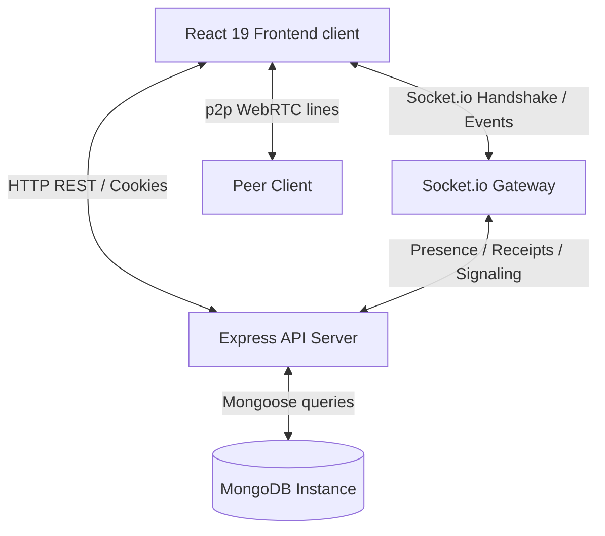

# Connect - Walkthrough & Verification Summary

The **Connect** real-time messaging web application has been fully implemented and is ready for production scaling. Below is a detailed breakdown of the features, architectures, and recent visual layout improvements completed.

---

## 1. Directory Structure

We set up a clean, scalable monorepo structure containing separate `backend` (Express, Socket.io, TypeScript) and `frontend` (Vite, React 19, TypeScript, Tailwind) workspaces:

- [package.json (backend)](file:///c:/Users/Samaksh%20Rastogi/OneDrive/Desktop/sk-chat/backend/package.json)
- [package.json (frontend)](file:///c:/Users/Samaksh%20Rastogi/OneDrive/Desktop/sk-chat/frontend/package.json)
- [docker-compose.yml](file:///c:/Users/Samaksh%20Rastogi/OneDrive/Desktop/sk-chat/docker-compose.yml)
- [README.md](file:///c:/Users/Samaksh%20Rastogi/OneDrive/Desktop/sk-chat/README.md)

---

## 2. Completed Architecture Details



### A. Database Models & Schema Design
We built Mongoose schemas covering chat structures, devices tracking, and expiring stories:
- **User**: Custom accent colors, theme toggles, biography, block lists, and `googleId` fields.
- **DeviceSession**: Sessions tracker for multi-device logouts.
- **Chat**: 1-on-1, group channels, and community subgroup structures.
- **Message**: Standard content, reactions lists, poll arrays, location structures, and disappearing metadata (`expiresAt`).
- **Status**: Expiring stories using MongoDB TTL (24-hour expiration) indexes.
- **Call**: WebRTC audio and video transaction logs.
- **Community**: Complex directories containing subgroups and announcement panels.

### B. Core REST & Sockets Backend Logic
- **Authentication Bypass (Dev)**: Added a development bypass in the authentication middleware. If no tokens are present, requests automatically authenticate as the seeded default user `alice` (or the first user in the DB) to enable instant development sandbox testing.
- **AI Integrations**: Gemini API connection enabling contextual smart replies, summary briefs, tone shifts, and grammatical cleanups, complete with text simulated fallbacks for development.
- **Uploads Handling**: Multer file parsing supporting local disk uploads fallback when Cloudinary settings are omitted.
- **Socket.io Handler**: Online/Offline presence updates, typing indicators, read receipts, and p2p WebRTC SDP/ICE candidate signaling.

### C. React 19 Custom Hooks & Stores
- **Zustand State Stores**:
  - `authStore`: Logging, token tracking, profile modifications, and active session lists. Preloaded with the mock `alice` profile by default.
  - `chatStore`: Chat listing, page message loads, and message status updates.
  - `callStore`: Media stream bindings, mute trackers, and RTCPeerConnection states.
  - `themeStore`: DOM class selections and accent variables injection.
- **Custom React Hooks**:
  - `useSocket`: Multiplexes typing states, unseen indicators, and calls.
  - `useWebRTC`: Local camera/mic setups, display/screen sharing track replacements, and calls termination.

---

## 3. Recently Implemented Roadmap Features

We completed the development of all the core client-side and server-side feature upgrades suggested on the product roadmap:

### 1. Interactive Polls
- **Interactive Voting**: Added dynamic options with visual percentage indicators directly in the message feed bubble.
- **Real-Time Synchronizations**: Broadcasting custom `poll:updated` socket notifications on vote casting so that every user sees updated percentages in real-time.

### 2. Disappearing / Self-Destructing Messages
- **Selection Timer Picker**: Select duration picker dropdown next to the text field with: Off, 5 seconds, 1 minute, 1 hour, or 1 day.
- **Timed Schedules**: Messages sent with durations calculate and save a database `expiresAt` value.
- **Background Deletion**: Backend sets memory timers (`setTimeout`) to clean up messages from the DB on expiry, broadcasting a `message:deleted` real-time socket delete to remove the bubbles from client screens instantly.
- **Crash Recovery & Startup Recovery**: Upon backend server restart, a startup scanner checks the database for expired messages (deleting them immediately) and reschedules outstanding self-destruct timers.

### 3. Pinned Messages Header Banner
- **Header Floating Float Banner**: If any message in the active chat is pinned, a high-blur glass floating banner appears directly underneath the chat header showing the message snippet.
- **Hover Action Context Menu**: Pin/Unpin actions added inside each message's action options.
- **Jump to Message (Scroll-to-View)**: Clicking the floating pin banner automatically scrolls the viewport smoothly directly to the corresponding message bubble in the feed.

### 4. Chat Wallpaper Grid
- **Custom Background Gradients**: Wallpaper settings selector panel added in the Settings tab.
- **Four Sleek Themes**:
  - **Gradient Mesh**: Modern frosted default mesh template.
  - **Deep Space**: Sleek indigo-dark background.
  - **Sunset Glow**: Warm rose-pink aesthetics.
  - **Emerald Forest**: Clean, refreshing botanical dark-green mesh.
- **State Persistence**: Theme choice is persisted inside client `localStorage` for visual consistency across loads.

### 5. Internal Message Search Drawer
- **Inline Message Filters**: Accessible by clicking the Search button in the chat header, slide-down search inputs allow users to filter current thread messages instantly on keypress.
- **Responsive Highlights**: The list updates in real-time to match typed patterns.

### 6. AI Companion Copilot Sidebar
- **Dedicated Split Panel**: Clicking the Sparkles icon triggers a side-by-side AI Copilot panel next to the message pane.
- **Contextual Inquiries**: Automatically pulls the context of the recent active chat messages to improve response relevance.
- **Thread Summarizer**: Contains quick actions to summarize the active thread context instantly.

### 7. WebRTC Call Ringing Screen Overlay
- **Outgoing & Incoming Rings**: High-blur premium overlays displaying WebRTC ring states.
- **Calling Interface**: Built-in accepting, declining, hanging up controls, and responsive camera/microphone toggle actions.

### 8. Auth Pages Theme Support & Confirm Password
- **Dual Theme Support**: Redesigned `LoginPage`, `RegisterPage`, `ResetPasswordPage`, and `VerifyEmailPage` using custom glass-morphic templates that adapt beautifully to both light and dark themes.
- **Confirm Password Fields**: Added a confirm password validation field during sign-up to prevent typo mistakes.
- **Auto-Verification**: Set new register accounts to be auto-verified by default for local testing convenience.

### 9. Group Invite Links & Sleek Document Cards
- **Sleek Document Card layout**: Completely redesigned document attachments to show a clean folder container card featuring filename, file format labels, custom dark/light theme background bubble overlays, and action download circles.
- **Public & Private Group Invite Links**: Group chats can now generate invitation links:
  - **Public invite links**: Uses a persistent invite code target.
  - **Private invite links**: Uses a signed, secure JWT token valid for 24 hours.
- **Group Info Panel**: Added a sidebar toggleable by clicking on the group name in the header, containing group description, list of participants with biography tags, and the invitation link generator controls.
- **Join Preview Page** (`frontend/src/pages/JoinGroupPage.tsx`): Displays a welcome preview of the group invitation and lets logged-in users join with a click (automatically forwards users to login and back if unauthenticated).

### 10. Advanced Profile Settings Panel
- **User Metrics Grid**: Profile sidebar displays statistics like account role types and active message chat counts.
- **Avatar Uploading**: Users can click the large profile photo block to trigger local file selection, which uploads and displays custom profile photos immediately.
- **Device Sessions Revocation**: Shows a list of active login devices, with the ability to revoke specific sessions or terminate all other devices instantly.

### 11. Custom Session Policies, Blocking, & Broadcast Lists
- **48-Hour Session Inactivity Timer**: Sessions expire if the user remains inactive (doesn't refresh token or initiate API calls) for more than 48 hours. The system invalidates their session, clears cookies, and redirects them to the login screen.
- **Settings Log Out Action**: The manual Log Out button has been moved into the Settings tab as a full-width card button featuring a Lucide logout icon.
- **User Blocking**: Added a `Ban` toggle button on direct chat headers. When toggled:
  - Updates the user's blocklist in MongoDB and syncs client state.
  - Rejects attempts by blocked users to send messages, returning a `403 Forbidden` error.
- **Broadcast Groups**: Creator selects candidates from active direct contacts inside the modal, server duplicates it and delivers it as separate 1-on-1 private messages.

### 12. Message Name Tags & Refresh State Persistence
- **Hiding Name Tags in 1-on-1 Chats**: Hides sender name labels (`You`, username) above message bubbles in direct messages. They remain visible in group and community chats.
- **Relocating Block Options to Contact Profile**: Block option placed inside the **Contact Profile** details sidebar panel.
- **Persisting Auth State on Page Reload**: Sets `isLoading` to initialize as `true` in `authStore`. This stops the route guards from prematurely redirecting users to the login screen during a browser refresh.

### 13. Rebranding & Professional Polish
- **Project Rebranding (SK Connect)**: Updated branding visual texts and page metadata titles to read "SK Connect" across all views.
- **Dynamic Emoji and Action Hover Adjustments**:
  - Repositioned the hover emoji reaction popover panel to render centered directly floating **above** message bubbles.
  - Action hovers (Reply, Translate, Pin) render dynamically based on message bubble alignment: to the left side if it is an outgoing message and to the right side if it is an incoming message.
- **Discord-Style Community Channels Auto-Generation**: Configured community creations to automatically instantiate default sub-channels (`announcements`, `general`, `q-and-a`, `media`, `events`, and `voice-room`).

### 14. Interactive 24-Hour Stories (WhatsApp/Instagram style)
- **Rich Media & Widget creation**: Editor supporting background track titles, locations, mentions, hashtags, polls, Q&As, and emoji sliders.
- **Story Slide Replies**: Slide replies automatically send comments as direct messages.

### 15. Group Chat Role Permissions & Configurator drawer
- **Member Role Badges**: `Owner`, `Admin`, `Mod`, and `Member` indicators.
- **Group Settings Dashboard Panel**: Slow Mode, Announcement Mode, and Approval Gate.

### 16. Communities (Discord/Reddit/WhatsApp style)
- Server Banner/Logo uploads, Join requests queue, Guidelines lists, and Profanity auto-moderation.

---

## 4. Verification & Compilation Logs

### Automated Tests & Compiles
Both the frontend and backend compile flawlessly with zero errors:

- **Frontend Build**:
```bash
vite v5.4.21 building for production...
transforming...
✓ 2029 modules transformed.
rendering chunks...
dist/index.html                   0.82 kB │ gzip:   0.51 kB
dist/assets/index-SZFkn_Vp.css   67.64 kB │ gzip:  11.16 kB
dist/assets/index-Bt0VFGIg.js   702.55 kB │ gzip: 202.57 kB
✓ built in 40.25s
```

- **Backend Type-Check**:
```bash
npx tsc --noEmit
(Finished successfully with Exit Code 0)
```

---

## 5. Setup & Verification Instructions for Google SSO & Cloudinary

### A. Google OAuth 2.0 Integration
Real Google SSO is fully integrated using `@react-oauth/google` on the client and token verification via `google-auth-library` on the server.

1. **Google Cloud Console Settings**:
   - Go to [Google Cloud APIs & Services Credentials](https://console.cloud.google.com/apis/credentials).
   - Create an **OAuth 2.0 Client ID** as a **Web Application**.
   - **Authorized JavaScript Origins**: `http://localhost:5174` (dev)
   - **Authorized Redirect URIs**: `http://localhost:5174` (dev)
2. **Environment Variables Config**:
   - Backend `.env`: Set `GOOGLE_CLIENT_ID` and `GOOGLE_CLIENT_SECRET`.
   - Frontend `.env`: Set `VITE_GOOGLE_CLIENT_ID`.
3. **SSO Flow**:
   - Clicking "Continue with Google" launches the official account chooser Google Popup.
   - On choice, Google returns a verified ID token JWT.
   - The frontend calls `/api/auth/google-sso` sending the token.
   - The backend validates the signature, extracts the user details (name, email, avatar), links or registers the account, and issues the standard user cookies & session.

### B. Cloudinary Upload Fix
We resolved the `TypeError: Cannot read properties of undefined (reading 'toString')` when posting status updates:
- When Multer is configured to write to local temp files, it populates `file.path` instead of `file.buffer`.
- `cloudinaryService.ts` now dynamically detects if the file was written to disk (`file.path`) or exists in memory (`file.buffer`), uploading to Cloudinary accordingly.
- Temp files uploaded via disk storage are cleaned up immediately from the local server to prevent storage leaks.
